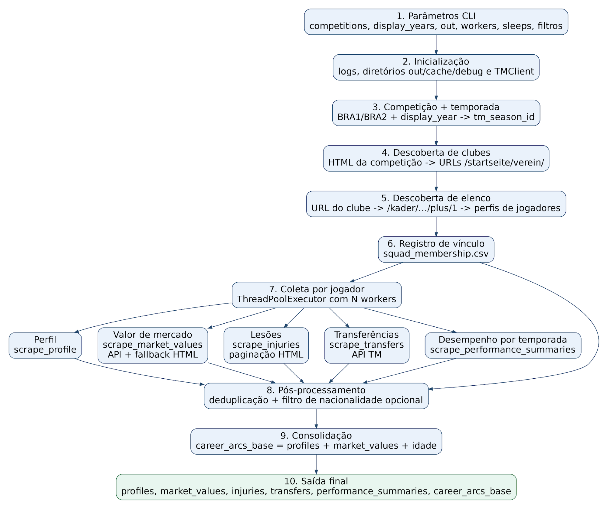
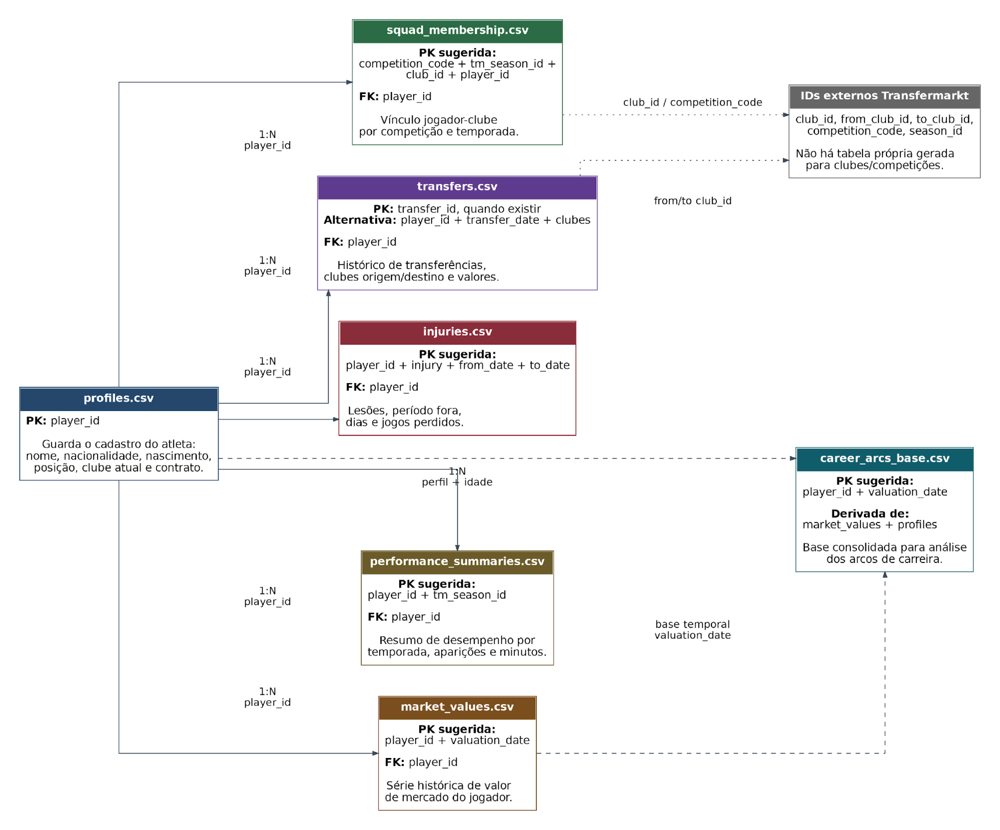
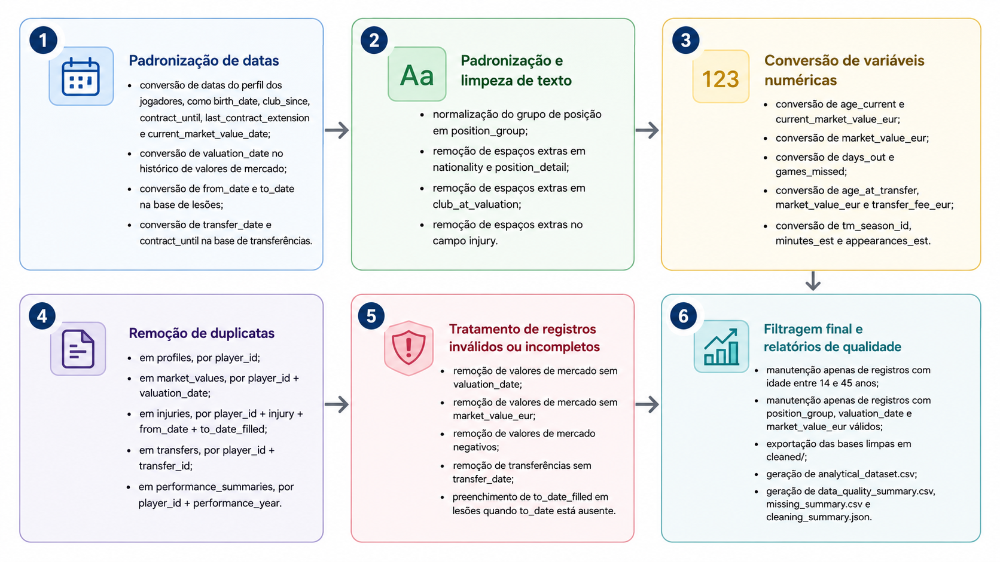
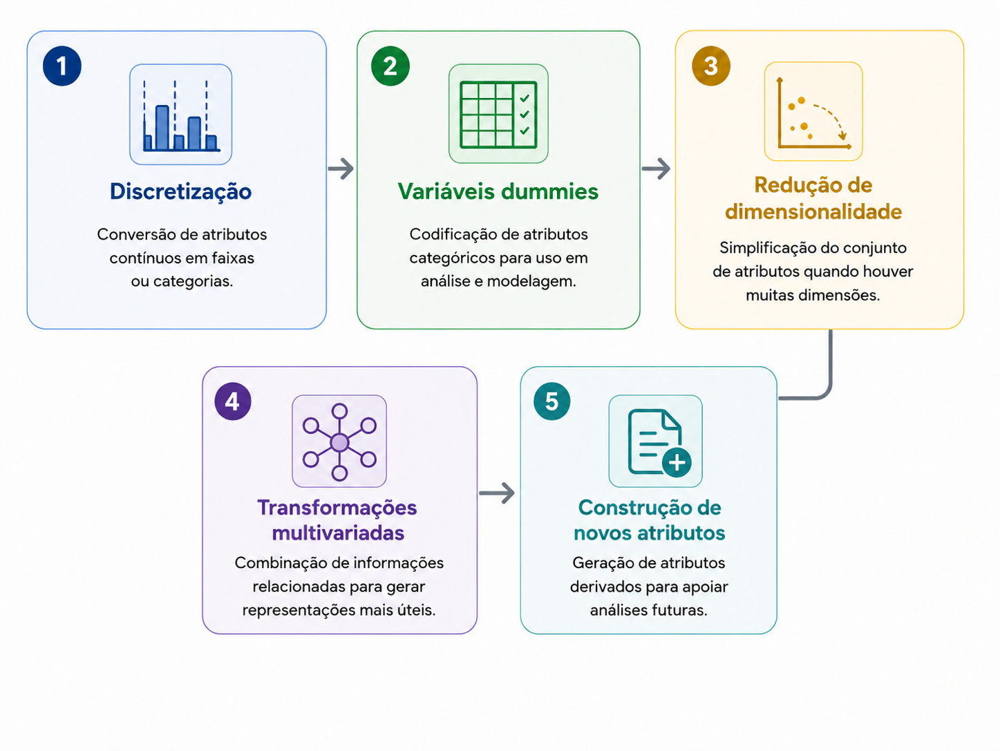

# Arcos de Carreira no Transfermarkt
Este projeto contém o script `transfermarkt_scraping.py`, usado para coletar dados de jogadores no Transfermarkt e gerar arquivos `.csv` para análise de arcos de carreira.

O script percorre competições, temporadas, elencos e perfis de jogadores e salva informações de:

- vínculo do jogador com clubes por temporada;
- perfil do atleta;
- histórico de valor de mercado;
- lesões;
- transferências;
- resumo de desempenho por temporada;

## Requisitos
- Python 3.10+;
- acesso à internet;
- dependências do arquivo `requirements.txt`.

Instalação:
```bash
pip install -r requirements.txt
```
---
---
# Pipeline Scraper
<p align="center">
  
</p>

## Como executar
Execução padrão:
```bash
python transfermarkt_scraping.py
```

Por padrão, o script:

- coleta dados das competições `BRA1` e `BRA2`;
- percorre `display_year` de `2018` até `2026`;
- salva a saída em `data_transfermarkt_arcos`;
- usa `4` workers na etapa de coleta por jogador;
- espera entre `1.0` e `2.0` segundos entre requisições.

## Exemplos de uso
Executar um teste pequeno:
```bash
python transfermarkt_scraping.py \
  --competitions BRA1 \
  --display-start 2024 \
  --display-end 2024 \
  --max-players 10 \
  --workers 1 \
  --out data_transfermarkt_test
```

Filtrar o conjunto final para jogadores brasileiros:
```bash
python transfermarkt_scraping.py \
  --nationality-filter Brasil \
  --out data_transfermarkt_br
```

Executar com logs detalhados:
```bash
python transfermarkt_scraping.py --log-level DEBUG
```

## Parâmetros disponíveis
```bash
python transfermarkt_scraping.py --help
```
Argumentos:
- `--display-start`: ano inicial exibido no loop de temporadas. Padrão: `2018`.
- `--display-end`: ano final exibido no loop de temporadas. Padrão: `2026`.
- `--competitions`: lista de competições. Padrão: `BRA1 BRA2`.
- `--nationality-filter`: filtra os arquivos finais pela nacionalidade do jogador. Ex.: `Brasil`.
- `--out`: diretório de saída. Padrão: `data_transfermarkt_arcos`.
- `--min-sleep`: pausa mínima entre requisições HTTP. Padrão: `1.0`.
- `--max-sleep`: pausa máxima entre requisições HTTP. Padrão: `2.0`.
- `--max-players`: interrompe a coleta após atingir um número máximo de jogadores únicos.
- `--workers`: quantidade de workers paralelos na etapa por jogador. Padrão: `4`.
- `--log-level`: nível de log no console. Opções: `DEBUG`, `INFO`, `WARNING`, `ERROR`, `CRITICAL`.

## Competições suportadas
No código atual, as competições mapeadas são:

- `BRA1`: Campeonato Brasileiro Série A
- `BRA2`: Campeonato Brasileiro Série B

Se você passar outros códigos sem antes alterar o dicionário `COMPETITION_SLUGS`, o script não saberá montar a URL corretamente.

---
---

# Estrutura dos Dados
Dentro da pasta definida em `--out`, o script gera:

- `squad_membership.csv`: relação jogador-clube-temporada encontrada nos elencos.
- `profiles.csv`: dados cadastrais e contratuais do jogador.
- `market_values.csv`: histórico de valor de mercado por data.
- `injuries.csv`: histórico de lesões.
- `transfers.csv`: histórico de transferências.
- `performance_summaries.csv`: resumo de desempenho por temporada.
- `career_arcs_base.csv`: base consolidada com perfil + valores de mercado + idade estimada.
- `cache/`: HTMLs salvos para reaproveitar requisições.
- `debug/`: páginas salvas quando o histórico de valor de mercado não pôde ser extraído.

<p align="center">
  
</p>


## Colunas principais
`squad_membership.csv`
- `competition_code`, `display_year`, `tm_season_id`, `season_label`
- `club_id`, `club_slug`, `club_name_guess`
- `player_id`, `player_slug`, `profile_url`, `squad_url`

`profiles.csv`
- `player_id`, `player_slug`, `player_name`, `profile_url`
- `full_name`, `birth_date`, `age_current`, `birth_place`, `nationality`
- `height_text`, `position_group`, `position_detail`, `preferred_foot`
- `agent`, `current_club`, `club_since`, `contract_until`, `last_contract_extension`
- `current_market_value_eur`, `current_market_value_date`

`market_values.csv`
- `player_id`, `player_slug`, `valuation_date`, `market_value_eur`
- `club_at_valuation`, `source_pattern`

`injuries.csv`
- `season_label`, `injury`, `from_date`, `to_date`
- `days_out`, `games_missed`, `player_id`, `player_slug`

`transfers.csv`
- sempre contém `player_id` e `player_slug`;
- as demais colunas dependem da tabela identificada no HTML do Transfermarkt;
- quando presentes, colunas de data são convertidas para data e colunas monetárias também ganham versões com sufixo `_eur`.

`performance_summaries.csv`
- `player_id`, `player_slug`, `tm_season_id`, `season_label`
- `summary_row_text`, `metric_-`
- `minutes_est`, `appearances_est`

`career_arcs_base.csv`
- herda dados de `market_values.csv`;
- agrega colunas de perfil como `player_name`, `full_name`, `birth_date`, `nationality`, `position_group` e `position_detail`;
- calcula `age_years` na data de cada avaliação de mercado.

## Observações importantes
- O script depende da estrutura HTML atual do Transfermarkt. Se o site mudar, alguma etapa pode parar de extrair dados corretamente.
- O filtro `--nationality-filter` é aplicado no fim da coleta. Ou seja, ele reduz os arquivos finais, mas não evita a raspagem anterior.
- Alguns arquivos podem sair vazios se uma etapa não encontrar dados.
- A pasta `cache/` evita baixar novamente páginas já coletadas no mesmo diretório de saída.
- O diretório `debug/` só aparece quando a etapa de valor de mercado falha para algum jogador.

## Interpretação das temporadas
O script trabalha com dois conceitos:
- `display_year`: ano usado no loop de execução;
- `tm_season_id`: ano-base da temporada no Transfermarkt.

Exemplo:
- `display_year = 2018`
- `tm_season_id = 2017`
- `season_label = 17/18`

---
---

# Pré-processamento e Transformações
Após a coleta e a consolidação dos arquivos gerados pelo `transfermarkt_scraping.py`, a base passa por uma etapa de pré-processamento para garantir que os dados estejam consistentes, comparáveis e adequados às análises de arcos de carreira. Ademais, se faz preciso também passar por uma etapa de transformação, responsável por converter o dado bruto em uma forma padrão para mineração, incluindo discretizações, criação de dummies, redução de dimensionalidade, transformações multivariadas e construção de novos atributos. 

Com essas etapas, a base final deixa de ser apenas uma consolidação dos dados coletados e passa a representar uma estrutura analítica voltada ao estudo dos arcos de carreira. Assim, cada registro combina informações de perfil, valor de mercado, idade, posição, lesões, transferências e desempenho, permitindo análises mais consistentes sobre a evolução dos jogadores ao longo do tempo.

Os códigos/scripts utilizados para realizar ambas as etapas estão disponíveis em:
- `script/commom.py`: contém majoritariamente o código modularizado utilizado no pré-processamento;
- `script/clean_base.py`: contém o código responsável por executar o pré-processamento e as transformações aplicadas à base.


##  Pré-processamento
As principais ações de pré-processamento aplicadas ao projeto são:

<p align="center">
  
</p>

- **Padronização de datas**
  - conversão de datas do perfil dos jogadores, como `birth_date`, `club_since`, `contract_until`, `last_contract_extension` e `current_market_value_date`;
  - conversão de `valuation_date` no histórico de valores de mercado;
  - conversão de `from_date` e `to_date` na base de lesões;
  - conversão de `transfer_date` e `contract_until` na base de transferências.

- **Padronização e limpeza de texto**
  - normalização do grupo de posição em `position_group`;
  - remoção de espaços extras em `nationality` e `position_detail`;
  - remoção de espaços extras em `club_at_valuation`;
  - remoção de espaços extras no campo `injury`.

- **Conversão de variáveis numéricas**
  - conversão de `age_current` e `current_market_value_eur`;
  - conversão de `market_value_eur`;
  - conversão de `days_out` e `games_missed`;
  - conversão de `age_at_transfer`, `market_value_eur` e `transfer_fee_eur`;
  - conversão de `tm_season_id`, `minutes_est` e `appearances_est`.

- **Remoção de duplicatas**
  - em `profiles`, por `player_id`;
  - em `market_values`, por `player_id + valuation_date`;
  - em `injuries`, por `player_id + injury + from_date + to_date_filled`;
  - em `transfers`, por `player_id + transfer_id`;
  - em `performance_summaries`, por `player_id + performance_year`.

- **Tratamento de registros inválidos ou incompletos**
  - remoção de valores de mercado sem `valuation_date`;
  - remoção de valores de mercado sem `market_value_eur`;
  - remoção de valores de mercado negativos;
  - remoção de transferências sem `transfer_date`;
  - preenchimento de `to_date_filled` em lesões quando `to_date` está ausente.

- **Filtragem final e relatórios de qualidade**
  - manutenção apenas de registros com idade entre 14 e 45 anos;
  - manutenção apenas de registros com `position_group`, `valuation_date` e `market_value_eur` válidos;
  - exportação das bases limpas em `cleaned/`;
  - geração de `analytical_dataset.csv`;
  - geração de `data_quality_summary.csv`, `missing_summary.csv` e `cleaning_summary.json`.

## Transformações

Esta etapa é responsável por transformar a base dados limpa em uma estrutura mais adequada para análise longitudinal, mineração de dados e modelagem. A partir das tabelas tratadas, o script constrói uma base analítica enriquecida, na qual cada registro representa uma avaliação de valor de mercado de um jogador em determinado momento da carreira.

Inicialmente, foram consideradas diferentes abordagens de transformação para o conjunto de dados, conforme sintetizado na imagem abaixo:

<p align="center">
  
</p>

Entre as possibilidades avaliadas, estavam:

- discretização de variáveis contínuas, como idade, valor de mercado e tempo de carreira;
- criação de variáveis dummies para atributos categóricos, como posição, nacionalidade ou tipo de transferência;
- redução de dimensionalidade, caso o conjunto de variáveis se tornasse muito amplo;
- transformações multivariadas para combinar informações relacionadas;
- construção de novos atributos derivados, capazes de representar melhor a trajetória dos jogadores ao longo do tempo.

Após a análise da base disponível e dos objetivos desta etapa, as transformações efetivamente aplicadas foram:

- **Transformações no perfil dos jogadores**
  - normalização do grupo de posição em `position_group`;

- **Transformações no histórico de valores de mercado**
  - associação dos valores de mercado com informações selecionadas do perfil do jogador;
  - construção da base longitudinal a partir da junção entre `market_values` e `profiles`.

- **Transformações temporais e de trajetória**
  - cálculo de `age_years`, representando a idade do jogador na data da avaliação;
  - identificação da primeira avaliação de mercado em `first_valuation_date`;
  - cálculo de `time_since_first_valuation_days`;
  - cálculo de `career_year`, representando o tempo de carreira observado desde a primeira avaliação;
  - criação de `n_valuations_total`, indicando o total de avaliações disponíveis por jogador;
  - criação de `n_valuations_so_far`, indicando a posição de cada avaliação dentro da trajetória do jogador;
  - criação das flags `meets_min_3_vals` e `meets_min_4_vals`, usadas para identificar jogadores com quantidade mínima de avaliações.

- **Transformação do valor de mercado**
  - criação de `log_market_value`;
  - aplicação da transformação `log(1 + market_value_eur)`, com o objetivo de reduzir a assimetria dos valores de mercado e facilitar análises estatísticas.

- **Transformações derivadas de desempenho**
  - associação de cada avaliação de mercado à temporada de desempenho anterior ou equivalente;
  - criação de `performance_year_ref`, indicando o ano de desempenho usado como referência;
  - criação de `season_label_ref`, indicando a temporada associada;
  - criação de `performance_gap_years`, indicando a diferença entre o ano da avaliação e o ano de desempenho usado;
  - incorporação de `minutes_est`, `appearances_est` e `minutes_per_appearance`.

- **Transformações derivadas de lesões**
  - cálculo de `injury_count_last_365`, indicando o número de lesões nos 365 dias anteriores à avaliação;
  - cálculo de `days_injured_last_365`, indicando a quantidade de dias lesionado no mesmo período;
  - cálculo de `games_missed_last_365`, indicando jogos perdidos nos 365 dias anteriores;
  - criação da flag `injury_recent`, indicando presença de lesão recente;
  - criação da flag `injury_severe_last_365`, indicando ocorrência de lesão severa no período.

- **Transformações derivadas de transferências**
  - cálculo de `transfer_count_career`, indicando o número de transferências acumuladas até a data da avaliação;
  - criação da flag `transfer_recent`, indicando transferência nos 365 dias anteriores à avaliação;
  - criação da flag `international_transfer_recent`, indicando transferência internacional recente;
  - criação da flag `competition_change_recent`, indicando mudança recente de competição;
  - cálculo de `days_since_last_transfer`, indicando o número de dias desde a última transferência;
  - incorporação de `last_transfer_fee_eur` e `last_transfer_market_value_eur`.

- **Geração da base analítica**
  - criação de `career_arcs_base_enriched.csv`, contendo a base longitudinal enriquecida;
  - criação de `analytical_dataset.csv`, contendo a base final filtrada para análise;
  - geração dos relatórios `data_quality_summary.csv`, `missing_summary.csv` e `cleaning_summary.json`.

### Exemplo de uso

Executar o processo de limpeza, transformação e geração da base analítica:

```bash
python scripts/clean_base.py --input-dir data_transfermarkt --output-dir results
```

# Resultado da Base Enriquecida
A base enriquecida final, `career_arcs_base_enriched.csv`, consolida as informações de perfil, valor de mercado, desempenho, lesões e transferências em uma estrutura longitudinal. Cada linha representa uma avaliação de valor de mercado de um jogador em uma determinada data, acompanhada de atributos derivados que descrevem sua trajetória até aquele momento.

A base possui **62.752 registros**, **40 colunas** e contempla **4.812 jogadores únicos**. As avaliações de valor de mercado vão de **04/10/2004** até **24/03/2026**, permitindo acompanhar a evolução dos jogadores ao longo do tempo.

| Indicador | Valor |
|---|---:|
| Registros | 62.752 |
| Colunas | 40 |
| Jogadores únicos | 4.812 |
| Data inicial de avaliação | 04/10/2004 |
| Data final de avaliação | 24/03/2026 |
| Valor mediano de mercado | €600.000 |
| Maior valor de mercado | €200.000.000 |
| Jogadores com pelo menos 3 avaliações | 4.299 |
| Jogadores com pelo menos 4 avaliações | 3.955 |

Em termos de posição, a base apresenta jogadores distribuídos entre os quatro grupos principais: ataque, defesa, meio-campo e goleiro. A maior parte dos registros está concentrada em jogadores de ataque, defesa e meio-campo, enquanto goleiros representam uma parcela menor da base.

| Grupo de posição | Registros |
|---|---:|
| Ataque | 19.916 |
| Defesa | 19.133 |
| Meio-campo | 19.027 |
| Goleiro | 4.676 |

Assim, a base enriquecida fornece uma estrutura adequada para análises longitudinais dos arcos de carreira, permitindo relacionar valor de mercado, idade, posição, desempenho, histórico de lesões e movimentações entre clubes ao longo do tempo.

---
---